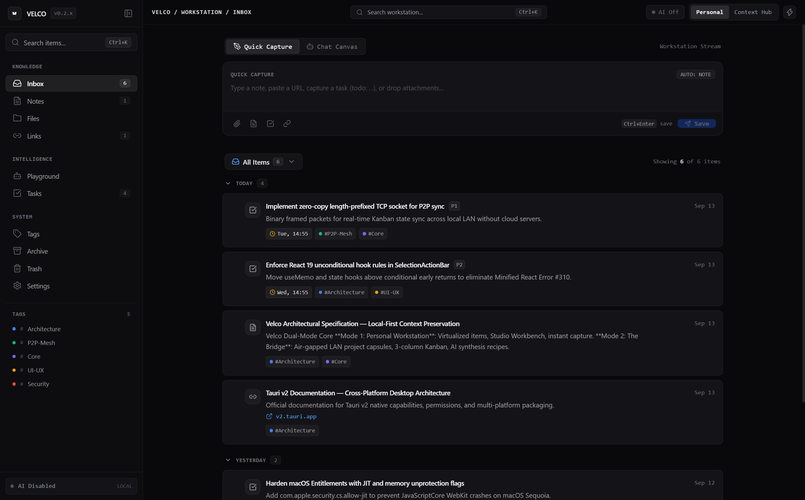
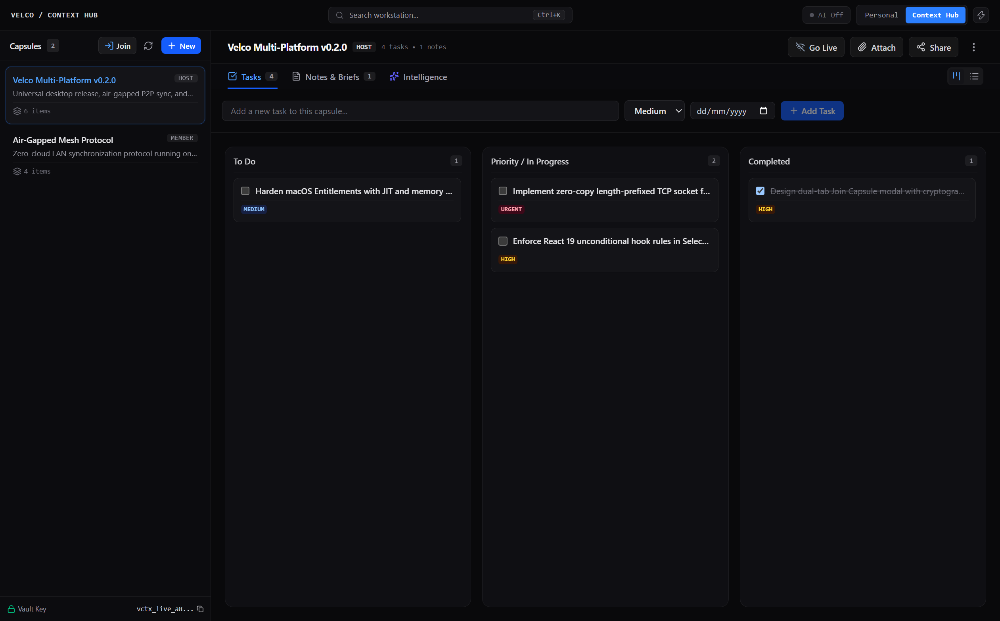
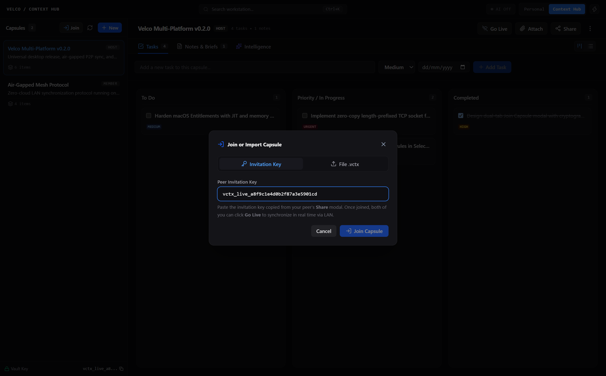
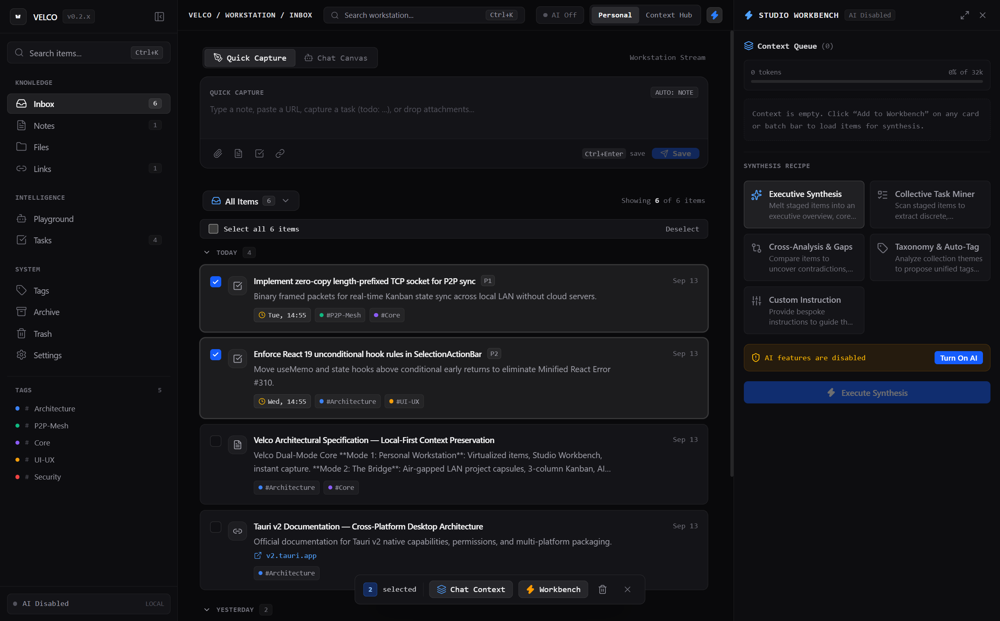

# Velco UI/UX Comprehensive Review & Design System Audit

  

> **Document Version**: 2.1.0  
> **Release Target**: Velco Universal Multi-Platform Release (v0.2.0)  
> **Design Philosophy**: Industrial Minimalism &bull; Zero-Slop Ergonomics &bull; Local-First Context Preservation

---

## 1. Executive Summary & Design Manifesto

Velco is engineered as a **high-density, context-bound AI workstation**. Unlike conventional web wrappers and bloated productivity tools cluttered with gratuitous gradients, cartoon avatars, and marketing padding, Velco adheres strictly to the tenets of **industrial minimalism**:

1. **High Information Density**: Actionable artifacts (tasks, notes, code snippets, Kanban cards, synthesis recipes) occupy maximum screen real-estate with clear boundaries.
2. **Context-Bounded Workflows**: Switching between personal ad-hoc captures and structured project collaboration is structural and instantaneous via the Dual-Mode header switch.
3. **Zero Compositor Friction**: Heavy GPU-bound filters (such as overlapping `backdrop-filter: blur()`) have been eliminated in favor of hardware-accelerated solid/alpha scrims with `transform-gpu` to guarantee rock-solid 120Hz performance across macOS WebKit, Windows WebView2, and Linux WebKitGTK.

---

## 2. Visual Architecture & Real Interface Analysis

### 2.1 Mode 1: Personal Workstation (Instant Stream & Virtualization)

  

- **Navigation Ergonomics**:
  - Collapsible dark sidebar (`Cmd+B` / `Ctrl+B`) with exact numeric counters for Inbox, Tasks, Notes, Files, Links, and custom tags.
  - Quick-capture dock supporting instant text parsing, markdown formatting buttons, and `Ctrl+Enter` / `Cmd+Enter` rapid submission.
- **Virtualized Rendering Engine**:
  - Integrated with `@tanstack/react-virtual` to maintain smooth scrolling across tens of thousands of items without DOM bloating or memory leaks.
  - Categorization chips (`P1 Urgent`, `P2 High`, `Architecture`, `P2P-Mesh`) provide instant cognitive separation.

---

### 2.2 Mode 2: The Bridge (Context Hub & 3-Column Kanban)

  

- **Project Capsule Navigator**:
  - Dedicated left sidebar listing project capsules with explicit roles (`HOST` / `MEMBER`), active item counters, and cryptographic vault key copy buttons.
  - Prominent **`Join`** button with link icon placed immediately adjacent to **`+ New`** to eliminate user friction when joining peer projects.
- **3-Column Technical Kanban**:
  - Columns: **To Do**, **Priority / In Progress**, and **Completed**.
  - Inline task creation bar with priority combobox (`Low`, `Medium`, `High`, `Urgent`) and date selector.
  - Instant checkbox toggle synchronizing task completion state directly to embedded SQLite tables without network latency.
- **Split-Pane Technical Documentation**:
  - Integrated split reader and markdown editor for technical specifications, architecture records, and meeting minutes.

---

### 2.3 P2P LAN Collaboration & Handshake UX

  

- **The Problem**: Conventional collaboration tools require cloud servers, user accounts, and telemetry, violating data privacy in enterprise or air-gapped environments.
- **The Solution**: Velco enables zero-cloud local peer-to-peer collaboration across LAN/Wi-Fi.
- **The Handshake Experience**:
  1. **Host (Sharer)**: Clicks `Share` on any active capsule to reveal the **Peer Invitation Key** (`vctx_live_...`) or export the encrypted `.vctx` bundle. Clicks `Go Live` to activate the UDP multicast beacon on port `42426`.
  2. **Peer (Joiner)**: Clicks the prominent `Join` button in the Capsules sidebar. The modal provides two distinct tabs:
     - **Tab 1 (Invitation Key)**: Paste the secret cryptographic token and click **`Join Capsule`**.
     - **Tab 2 (File .vctx)**: Drag-and-drop or select an encrypted project archive.
  3. **Auto-Discovery & Pairing**: As soon as both peers are on the same local network with **Go Live** active, the backend matches on SHA-256 `key_hash` or `capsule_id`.
  4. **Visual Telemetry**: The top header badge transitions to a pulsing green indicator: **`((o)) Live · 1 peer port 42426`**.

---

### 2.4 Floating Multi-Selection Action Bar

  

- **Zero-Friction Batch Triage**:
  - Automatically elevates from the bottom viewport when one or more items are selected.
  - Actions: **Attach to AI Context**, **Stage to Workbench**, and **Move to Trash**.
- **React 19 Rule-of-Hooks Compliance**:
  - All hooks (`useMemo`, state hooks) execute unconditionally above conditional early returns, completely eliminating Minified React Error #310 during item selection.
  - Enclosed within an isolated `ErrorBoundary` to ensure workspace crashes are prevented even during extreme rapid multi-selection.

---

## 3. Design System Tokens & Component Audit

| Design Token | Value / Implementation | Ergonomic Rationale |
| :--- | :--- | :--- |
| **Canvas Background** | Dark: `#09090b` / Light: `#f8fafc` | Ultra-low luminance reduces visual fatigue during extended synthesis sessions |
| **Card Elevators** | Dark: `#0e131f` / `#141418` | High-contrast visual hierarchy distinguishing cards from the background canvas |
| **Hairline Dividers** | `border-slate-200` / `dark:border-white/[0.08]` | Precise structural separation without bulky, distracting borders |
| **Typography** | Inter (UI) &bull; JetBrains Mono (Data/Dates) | Immediate cognitive distinction between interface controls and technical data |
| **Modal Scrims** | `bg-black/75 transform-gpu select-none` | Hardware-accelerated compositing; prevents WebKit blur crashes and background clicks |
| **Scrollbars** | Custom 5px slim thumb, zero horizontal overflow | Strict overflow-x containment prevents horizontal shift or wobble during scroll |

---

## 4. Conclusion & UX Verification

Velco **v0.2.0** achieves a rare balance between dense, technical power-user ergonomics and pristine aesthetic discipline. By purging decorative slop, stabilizing React 19 hook order, and providing an intuitive P2P handshake UX, Velco delivers an uncompromising workstation experience for modern software engineering.
